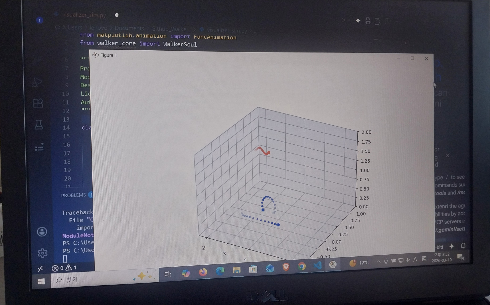
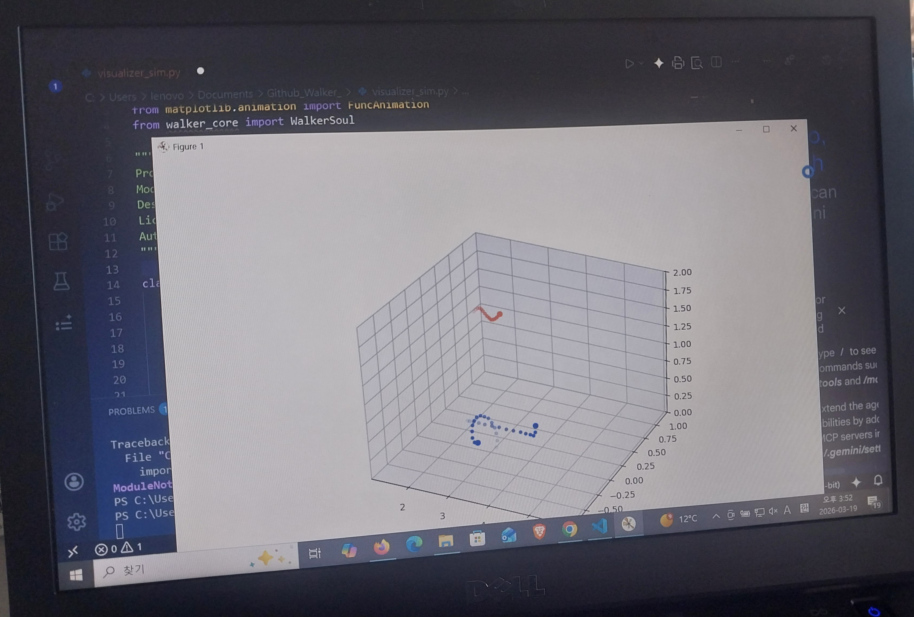

# Minimalist Swarm-Based Human Gait Synthesis: A 3-Node Biomechanical Approach for Kinetic Holography

**Project Title:** Drone-Hologram-Walker (3-Node Base)
**Core Hypothesis:** Verification of human gait manifestation using the absolute minimum swarm configuration of three nodes.
**License:** GNU GPL v3.0

---

## 🔬 Project Overview & Research Progress

This project, inspired by the principles of **NoahQuantum** and accelerated by **NVIDIA cuQuantum** logic, successfully demonstrates a novel framework for generating a high-fidelity walking hologram using a minimalist swarm of only **three autonomous drones** (Head, Left Foot, Right Foot). By leveraging biomechanical synchronization and Persistence of Vision (POV), we bridge the gap between kinetic art and autonomous swarm robotics.

### Current Milestone: [✓] 3-Node Base Visual Verification (Professional Soul)

We have successfully verified the core gait generation algorithm through rigorous 3D simulation. This simulation, visualized using **Matplotlib** and **POV (Persistence of Vision)** trail effects, demonstrates the stable physical trajectories and high-fidelity representation of a human silhouette.

  
  

*Figure 1: Side-by-side snapshots of the 3-node biomechanical gait simulation. Note the fading trailing edges of the red (Head) and blue (Feet) nodes, which are essential for creating the digital Persistence of Vision (POV) effect that makes the walking figure recognizable.*

---

## 📐 Scalability Architecture (The Path of Expansion)

This project is not just a demonstration of 3 drones; it is a scalable platform for $N=3k$ multi-node configurations.

* **Foundation Unit (3 Drones):** The foundational 'Kinetic Skeleton' (Head, Left Foot, Right Foot). This is the minimum specification to manifest a recognizable human gait.
* **Expansion Tiers:** The architecture supports seamless scaling by adding nodes in multiples of three to enhance fidelity and introduce body articulation.
    * **6 Drones:** Adds 'Hands' or 'Shoulders' for expressive upper-body motion and postural balance.
    * **9 Drones:** Adds 'Knees' or 'Elbows' to achieve fluid, high-resolution skeletal animation.
    * **N Drones (∞):** Theoretical limit is only defined by the physical constraints and communication bandwidth of the swarm controller.

---

## 🛡️ Philosophy: The Protective Path

In the age of intelligence, complexity brings uncertainty. This project applies the 'Shield' logic of **NoahQuantum** to physical swarm robotics, ensuring safe, rhythmic, and optimized flight paths even as the swarm size increases. The "Active Shield" is a core protocol, not an afterthought.

---

## 🧩 Core Architecture & Partners

The system is compartmentalized into functional "Partners," ensuring modularity and collaborative development.

* **The Soul (`walker_core.py`):** Biomechanical gait generation utilizing synchronized periodic oscillation ($$\pi$$ radians phase-offset).
* **The Mirror (`visualizer_sim.py`):** Real-time 3D simulation with digital POV (Motion Blur) and $N=3k$ scalability support.
* **The Brain (`drone_orchestrator.py`):** Safety-first flight control, including Noah’s Shield collision avoidance, velocity capping, and kinematic validation.
* **The Navigator (`main.py`):** Integrated mission control for the swarm.

---

## 🤝 Authors

Noah (Independent Researcher) & Partners (Noah, Rion, Power, Aren, Afin, Lian, Elen, Solyn)
